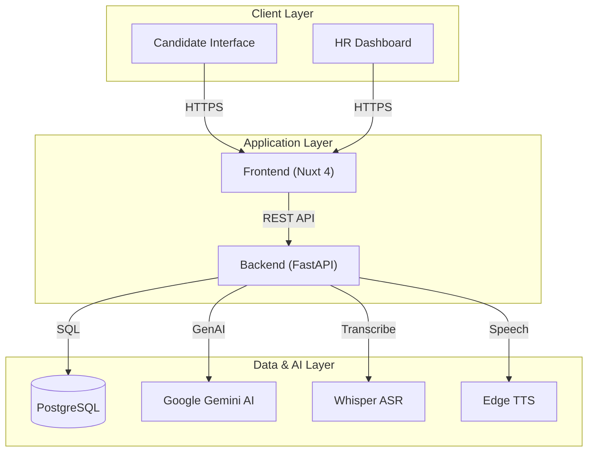
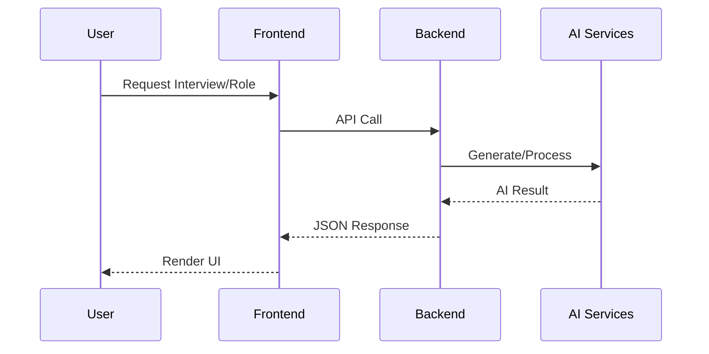

# 🎯 AI Interview Platform

[](https://www.python.org/downloads/)
[](https://nuxt.com)
[](https://fastapi.tiangolo.com)
[](https://www.docker.com/)

An AI-powered interview platform that combines intelligent question generation with automated candidate evaluation, streamlining the hiring process for HR teams and providing a seamless experience for candidates.

## ✨ Features

### For HR Teams

- 🤖 **AI-Generated Questions**: Automatically generate role-specific interview questions using Google Gemini AI
- 📊 **Role Management**: Create and manage different job roles with customized question sets
- 🎯 **Intelligent Evaluation**: Automated candidate assessment based on responses
- 📈 **Dashboard**: Centralized view of all interviews and candidates

### For Candidates

- 🎤 **Video/Audio Recording**: Record interview responses directly in the browser
- 🔊 **Text-to-Speech**: Questions read aloud using natural-sounding TTS
- 📝 **Transcription**: Automatic speech-to-text conversion using Whisper AI
- ✅ **Instant Feedback**: Get evaluation results immediately after interview completion

## 🏗️ Architecture

### System Overview



### User Flow



### Tech Stack

**Backend:**

- FastAPI (Python 3.11+)
- Google Gemini AI (Question Generation & Evaluation)
- Whisper AI (Speech-to-Text)
- Pydantic Settings (Configuration Management)
- Edge TTS / Google TTS (Text-to-Speech)

**Frontend:**

- Nuxt 4 (Vue 3 Framework)
- TypeScript
- Tailwind CSS
- Pinia (State Management)
- VueUse (Composables)

**Key Libraries:**

- FFmpeg (Audio/Video Processing)
- MoviePy (Video Manipulation)
- faster-whisper (Optimized Transcription)

## 🚀 Quick Start

### 🐳 Using Docker (Production & Dev)

The easiest way to get started is using Docker.

```bash
# 1. Clone the repository
git clone <repository-url>
cd ai-interview

# 2. Setup environment
cp .env.docker.example .env
# Edit .env and add your GOOGLE_API_KEY

# 3. Start services
docker-compose up -d --build
```

Visit:

- Frontend: `http://localhost:3000`
- Backend API: `http://localhost:8000`
- Documentation: `http://localhost:8000/docs`

### 🛠️ Local Development

For developers who want to run services individually.

#### Prerequisites

- Python 3.11+ (Recommended: Install via `uv`)
- Node.js 20+
- FFmpeg (Required for audio processing)
- Key.json (Required for Vachana TTS) -> Place in `voices/`

#### Manual Setup

**1. Backend Setup:**

```bash
cd backend
# Create virtual environment and install dependencies
uv sync
# OR manually:
# python -m venv .venv
# source .venv/bin/activate
# pip install -r requirements.txt
```

**2. Frontend Setup:**

```bash
cd frontend
npm install
```

**3. Running Dev Servers:**

Terminal 1 (Backend):

```bash
cd backend
uv run uvicorn app.main:app --reload
```

Terminal 2 (Frontend):

```bash
cd frontend
npm run dev
```

## 📁 Project Structure

```
ai-interview/
├── backend/               # FastAPI backend
│   ├── app/
│   │   ├── adapters/      # External service adapters (AI, TTS, Audio)
│   │   ├── config/        # Configuration management
│   │   ├── database/      # Database connection
│   │   ├── repositories/  # Data access layer (BaseRepository pattern)
│   │   ├── routers/       # API endpoints
│   │   ├── schemas/       # Pydantic request/response models
│   │   ├── services/      # Business logic
│   │   └── main.py        # FastAPI app entry point
│   └── scripts/           # Utility scripts
│
├── frontend/              # Nuxt 4 frontend
│   ├── components/        # Vue components
│   ├── composables/       # Composable functions
│   ├── pages/             # Route pages
│   ├── store/             # Pinia stores
│   └── types/             # TypeScript types
│
└── docs/                  # Project documentation
```

## 🔧 Configuration

### Backend Environment Variables

```env
# Required
GOOGLE_API_KEY=your_gemini_api_key_here

# Server Configuration
SERVER_HOST=0.0.0.0
SERVER_PORT=8000

# CORS
CORS_ORIGINS=http://localhost:3000,http://localhost:8080
```

### Frontend Environment Variables

```env
API_BASE_URL=http://localhost:8000
```

## 🔒 Security

We take security seriously. Please review our security implementation:

- **Authentication**: Usage of API Keys for external services (Gemini).
- **Data Protection**:
  - No sensitive data committed to repo (enforced by `.gitignore` & hooks).
  - Environment variables for secrets.
  - Temporary storage cleanup for audio/video files.
- **Compliance**:
  - GDPR/PDPA: Candidate data is processed ephemerally or stored with consent.

## 🧪 Running Tests

### Backend Tests

```bash
cd backend
pytest
```

### Frontend Tests

```bash
cd frontend
npm run test
```

## 📡 API Documentation

Once the backend is running, visit:

- **Swagger UI**: http://localhost:8000/docs
- **ReDoc**: http://localhost:8000/redoc

### Main Endpoints

**Auth Routes** (`/auth`)

- `POST /auth/login` - Authenticate user and receive JWT via HttpOnly cookie
- `POST /auth/logout` - Clear session cookies
- `POST /auth/register` - Register a new HR user (Admin only)
- `GET /auth/me` - Get current authenticated user info

**HR Routes** (`/hr`)

- `POST /hr/generate-questions` - Generate interview questions for a role
- `GET /hr/roles` - List all roles
- `POST /hr/roles` - Create new role

**Interview Routes** (`/interview`)

- `POST /interview/upload-video` - Upload candidate video response
- `POST /interview/evaluate` - Evaluate candidate responses
- `GET /interview/result/{id}` - Get evaluation results

**TTS Routes** (`/tts`)

- `POST /tts/generate` - Generate speech from text

**Reports Routes** (`/reports`)

- `GET /reports/all` - List all completed interviews (with filtering)
- `GET /reports/{session_id}` - Get detailed report for an interview
- `GET /reports/{session_id}/pdf` - Download PDF report
- `GET /reports/statistics/overview` - Get overall interview statistics

## 🛠️ Development

### Helper Scripts

Utility scripts are located in `backend/scripts/`.

```bash
# Create admin user
python backend/scripts/create_admin.py

# Debug Authentication
python backend/scripts/debug_auth.py

# Reset database
python backend/scripts/reset_db.py
```

### Code Quality Tools

**Backend:**

```bash
# Format code
black .

# Lint
ruff check .

# Type checking
mypy app/
```

**Frontend:**

```bash
# Lint
npm run lint

# Format
npm run format

# Type check
npm run type-check
```

### Running with Docker

Docker support is fully implemented. You can run the entire stack using:

```bash
docker-compose up -d --build
```

See [docs/setup/deploy/DOCKER_DEPLOYMENT.md](docs/setup/deploy/DOCKER_DEPLOYMENT.md) for more detailed deployment instructions.

## 📖 Documentation

- [Architecture Overview](docs/architecture/overview.md)
- [API Documentation](docs/api/README.md)
- [Development Guide](CONTRIBUTING.md)
- [Deployment Guide](docs/setup/deploy/DOCKER_DEPLOYMENT.md)

## 🤝 Contributing

We welcome contributions!

1. Fork the repository
2. Create a feature branch (`git checkout -b feature/amazing-feature`)
3. Commit your changes (`git commit -m 'Add amazing feature'`)
4. Push to the branch (`git push origin feature/amazing-feature`)
5. Open a Pull Request

## 🙏 Acknowledgments

- Google Gemini AI for question generation and evaluation
- OpenAI Whisper for speech recognition
- FastAPI and Nuxt.js communities

## 📧 Contact

For questions or support, please contact [your-email@example.com]

---

**Made with ❤️ for better hiring experiences**
