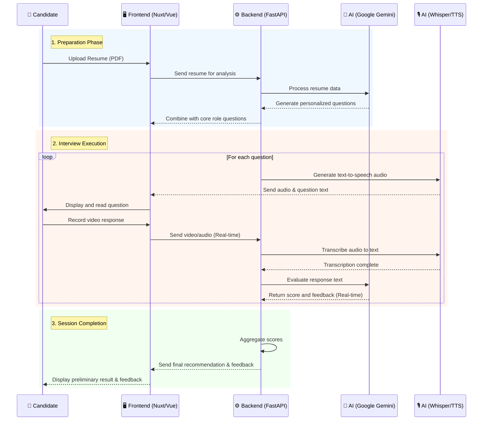

# 🎯 AI Interview Platform

An AI-powered interview platform that seamlessly integrates intelligent question generation and automated candidate evaluation, streamlining the hiring process for HR teams and delivering a top-tier candidate experience.

[](https://www.python.org/downloads/)
[](https://nuxt.com)
[](https://fastapi.tiangolo.com)
[](https://www.docker.com/)

## ✨ Key Features

**For HR Teams:**

- 🤖 **AI-Generated Questions**: Automatically generate role-specific interview questions using Google Gemini.
- 📊 **Role Management**: Efficiently manage job roles and tailored question sets.
- 🎯 **Intelligent Evaluation**: Automated candidate assessment and scoring.
- 📈 **Dashboard**: Centralized overview of all interviews and candidates.

**For Candidates:**

- 🎤 **Video/Audio Recording**: Record interview responses directly in the browser.
- 🔊 **Text-to-Speech**: Questions are read aloud naturally.
- 📝 **Transcription**: Automatic speech-to-text conversion via Whisper AI.
- ✅ **Instant Feedback**: Receive preliminary evaluation results immediately after the interview.

## 🚀 Quick Start

### 🐳 Using Docker (Recommended)

```bash
git clone <repository-url>
cd ai-interview
cp .env.docker.example .env # Ensure you configure your GOOGLE_API_KEY
docker-compose up -d --build
```

Access the system:

- Frontend: `http://localhost:3000`
- Backend API: `http://localhost:8000`
- API Docs: `http://localhost:8000/docs`

### 🛠️ Local Development

**Backend:**

```bash
cd backend
uv sync
uv run uvicorn app.main:app --reload
```

**Frontend:**

```bash
cd frontend
npm install
npm run dev
```

## � Workflow Process



## �📖 Further Documentation

- [Architecture Overview](docs/architecture/overview.md)
- [API Documentation](docs/api/README.md)
- [Docker Deployment Guide](docs/setup/deploy/DOCKER_DEPLOYMENT.md)
- [Contributing Guidelines](CONTRIBUTING.md)
