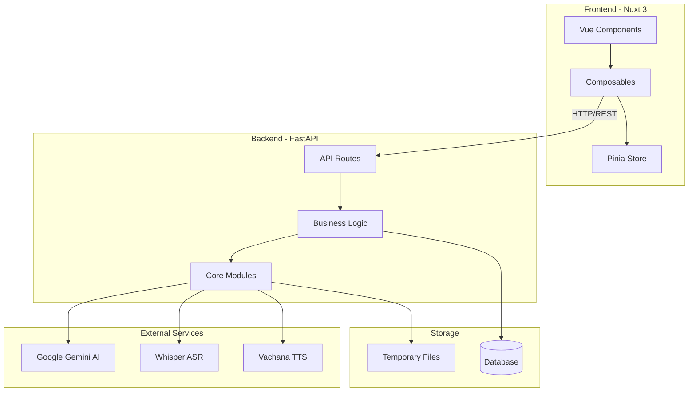
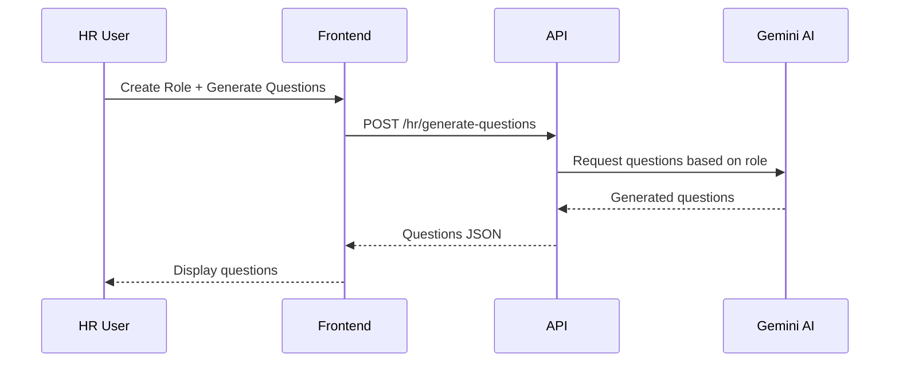
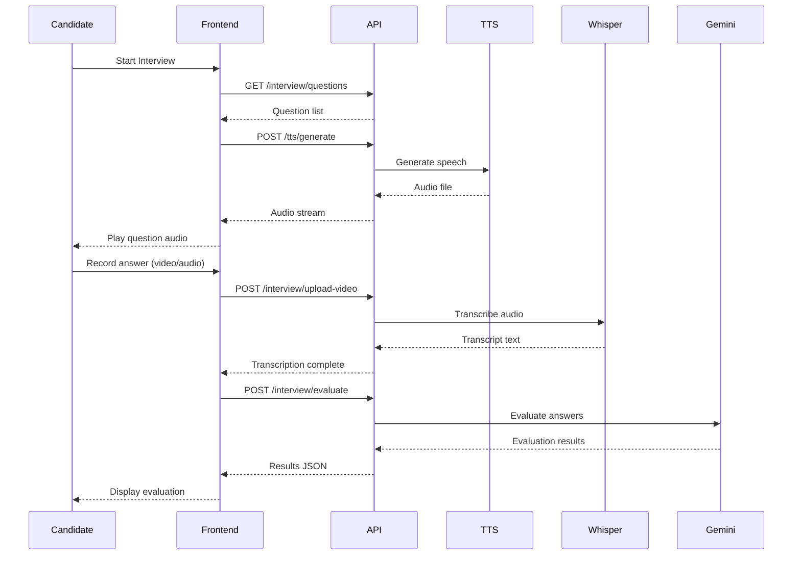
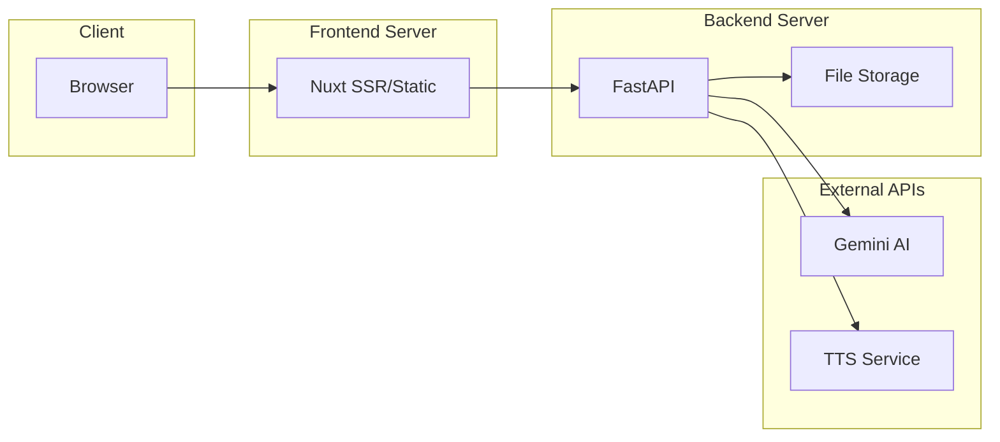

# System Architecture Overview

## High-Level Architecture

The AI Interview Platform is built as a modern, decoupled full-stack application with a clear separation between frontend and backend.



## Component Overview

### Frontend (Nuxt 3)

**Technology Stack:**

- **Framework:** Nuxt 3 (Vue 3 + SSR capabilities)
- **State Management:** Pinia
- **Styling:** Tailwind CSS
- **Type Safety:** TypeScript
- **HTTP Client:** Axios

**Key Features:**

- Auto-imported components and composables
- File-based routing
- TypeScript support
- Responsive design

### Backend (FastAPI)

**Technology Stack:**

- **Framework:** FastAPI (Python 3.11+)
- **AI:** Google Gemini API
- **Speech Recognition:** OpenAI Whisper / faster-whisper
- **TTS:** Vachana TTS (Thai support)
- **Media Processing:** FFmpeg, MoviePy

**Key Features:**

- Async/await support
- Automatic API documentation (Swagger/ReDoc)
- Type validation with Pydantic
- Dependency injection

## Data Flow

### HR Question Generation Flow



### Candidate Interview Flow



## Core Modules

### Backend Core Modules

**`core/ai_evaluator.py`**

- Evaluates candidate responses using Gemini AI
- Provides scoring and feedback

**`core/audio_processor.py`**

- Processes audio/video files
- Extracts audio from video
- Handles audio format conversions

**`core/question_generator.py`**

- Generates role-specific interview questions
- Uses Gemini AI for intelligent question creation

**`core/tts_generator.py`**

- Converts text questions to speech
- Supports multiple TTS engines

**`core/split_audio.py`**

- Splits long audio into manageable chunks
- Handles transcription of large files

## API Structure

```
/api/
├── /hr/
│   ├── POST /generate-questions
│   ├── GET  /roles
│   ├── POST /save-questions
│   └── GET  /roles/{id}
│
├── /interview/
│   ├── POST /upload-video
│   ├── POST /evaluate
│   ├── GET  /result/{id}
│   └── GET  /questions/{role_id}
│
└── /tts/
    └── POST /generate
```

## Security Considerations

1. **API Key Management**
   - Environment variables for sensitive keys
   - Never commit keys to version control

2. **CORS Configuration**
   - Configurable allowed origins
   - Secure defaults

3. **File Upload Security**
   - File type validation
   - Size limits
   - Temporary storage with cleanup

4. **Input Validation**
   - Pydantic models for all requests
   - Type checking and validation

## Scalability Considerations

### Current Architecture

- Monolithic backend (suitable for MVP)
- Client-side rendering with SSR capabilities
- File-based temporary storage

### Future Scalability Options

1. **Horizontal Scaling**
   - Containerize with Docker
   - Deploy multiple backend instances
   - Add load balancer

2. **Storage**
   - Move to cloud storage (S3, GCS)
   - Implement CDN for static assets
   - Add persistent database

3. **Caching**
   - Redis for session management
   - Cache frequently requested questions
   - Cache AI responses where appropriate

4. **Microservices** (if needed)
   - Separate TTS service
   - Separate transcription service
   - Separate evaluation service

## Deployment Architecture



## Technology Decisions

### Why FastAPI?

- Fast, modern Python framework
- Excellent async support
- Automatic API documentation
- Type safety with Pydantic
- Easy integration with AI libraries

### Why Nuxt 3?

- Vue 3 with Composition API
- SSR/SSG capabilities
- Auto-imports for better DX
- Strong TypeScript support
- Large ecosystem

### Why Gemini AI?

- Powerful language understanding
- Good question generation
- Competitive pricing
- Reliable API

### Why Whisper?

- State-of-the-art speech recognition
- Supports multiple languages
- Can run locally (faster-whisper)
- Open source

## Performance Considerations

1. **Audio Processing**
   - Use faster-whisper for GPU acceleration
   - Process in chunks for large files
   - Async processing to avoid blocking

2. **AI Request Optimization**
   - Batch requests where possible
   - Implement retry logic
   - Add timeout handling

3. **Frontend Optimization**
   - Code splitting
   - Lazy loading components
   - Image optimization
   - Caching strategies

## Monitoring & Logging

**Current:**

- Python logging module
- Configurable log levels
- File-based logs

**Recommended Future:**

- Structured logging (JSON)
- Log aggregation (ELK, Datadog)
- Error tracking (Sentry)
- Performance monitoring (New Relic, Datadog)

---

For more detailed API documentation, visit `http://localhost:8000/docs` when running locally.
