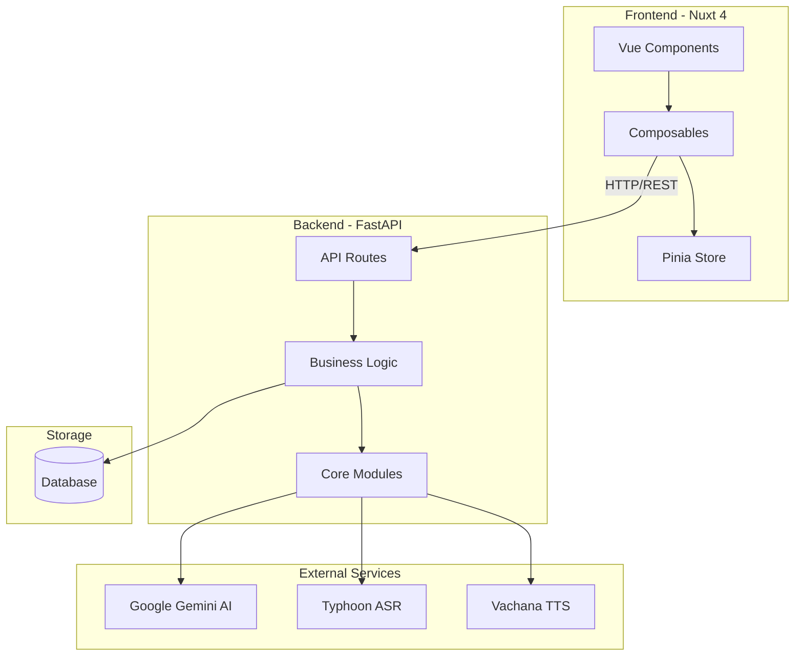
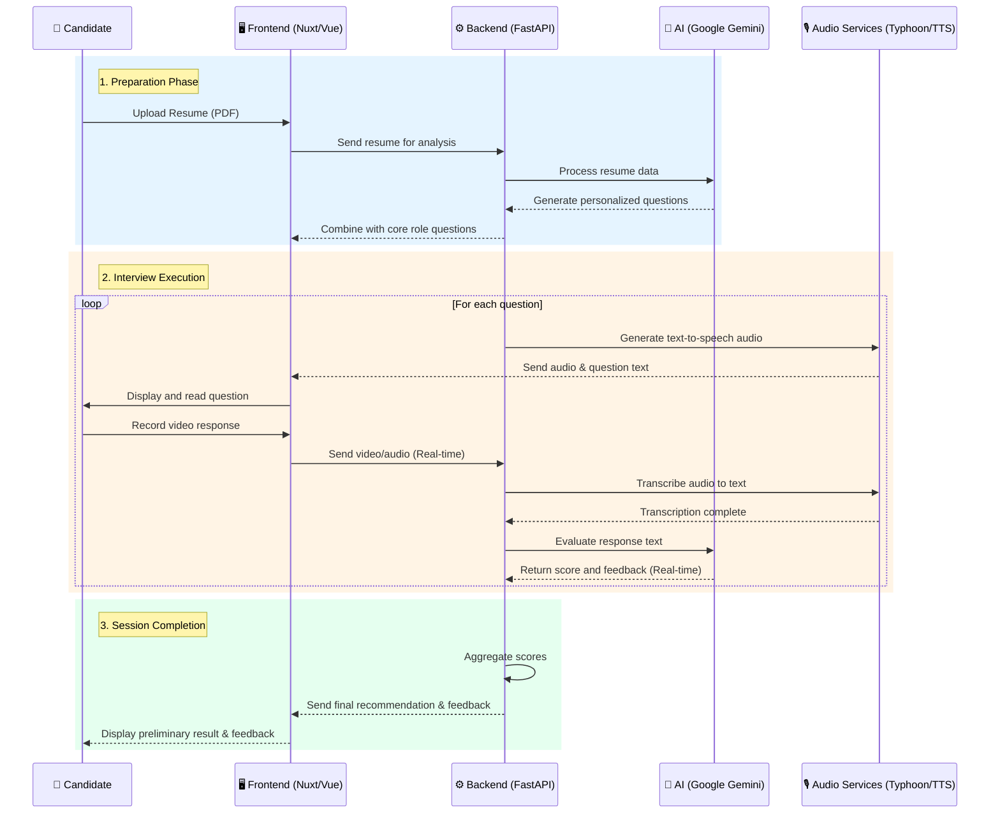

# Architecture Overview

## 🏗️ High-Level Architecture

The AI Interview Platform is designed as a Decoupled Full-Stack Application, maintaining a strict separation of concerns between the Frontend and Backend layers.

## 🧩 Component Overview

### Frontend (Nuxt 4)

- **Framework:** Nuxt 4 (Vue 3, leveraging SSR Capabilities)
- **State Management:** Pinia
- **Styling:** Tailwind CSS
- **Type Safety:** TypeScript

### Backend (FastAPI)

- **Framework:** FastAPI (Python 3.11+)
- **AI Engine:** Google Gemini AI (Question Generation & Evaluation)
- **Speech Recognition:** Typhoon ASR
- **Text-to-Speech:** Vachana TTS

## 🔄 Data Flow

**Interview Lifecycle:**

1. **Preparation:** The candidate uploads their Resume (PDF). The AI analyzes the document to construct personalized questions integrated with the core role questions.
2. **Interview Execution:**
   - Questions are presented on-screen accompanied by text-to-speech audio.
   - The candidate records a video response.
   - The video is transmitted to the Backend, where the audio is extracted, transcribed via Typhoon ASR, and evaluated in real-time by Google Gemini.
3. **Session Completion:** The system aggregates the individual question scores to yield a final recommendation and holistic feedback.

### Workflow Process Diagram

## 🔒 Security Best Practices

- Strict API Key management via Environment Variables.
- RESTful endpoints secured by configurable CORS Origins.
- Secure file upload handling with automated temporary file cleanup.

## 📈 Scalability Considerations

- Docker-ready architecture enabling horizontal scaling.
- Pluggable components facilitating future migration of storage to Cloud Storage (S3/GCS) and caching mechanisms to Redis.
