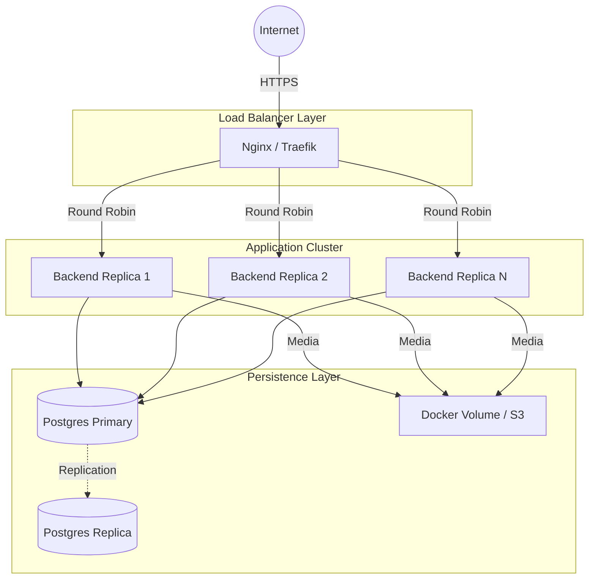
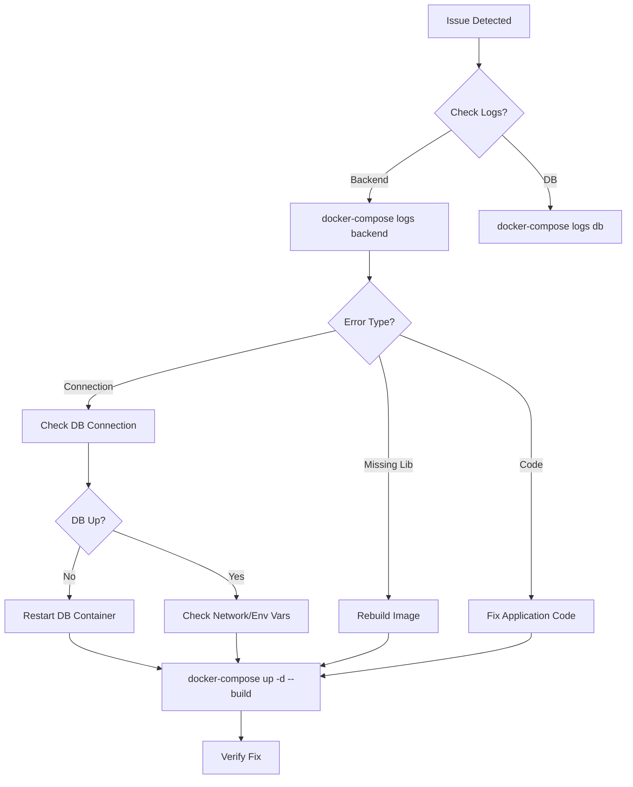

# Docker Deployment Guide

Complete guide for deploying AI Interview System using Docker.

## 🚀 Quick Start

### 1. Prerequisites

```bash
# Docker version 20.10+ with BuildKit support
docker --version
docker-compose --version
```

### 2. Environment Setup

```bash
# Copy environment file
cp .env.example .env

# Edit .env file with your actual values
nano .env
```

### 3. Build and Run

```bash
# Build with BuildKit
DOCKER_BUILDKIT=1 docker-compose build

# Start all services
docker-compose up -d

# View logs
docker-compose logs -f backend
```

### 4. Access Services

- **Backend API:** http://localhost:8000
- **API Docs:** http://localhost:8000/docs
- **Database:** localhost:5432
- **PgAdmin** (dev only): http://localhost:5050

- **PgAdmin** (dev only): http://localhost:5050

---

## 🏗️ Production Architecture

Concept of how this system scales in a production environment (e.g., Docker Swarm or Kubernetes).



---

## 📋 Available Commands

### Development Mode

```bash
# Start all services
docker compose up -d

# View all logs
docker compose logs -f

# Restart backend only
docker compose restart backend

# Rebuild after code changes
docker compose up -d --build backend
```

### Production Mode

```bash
# Start production services only
docker-compose up -d

# Check health status
docker-compose ps

# View resource usage
docker stats
```

### Maintenance

```bash
# Stop all services
docker-compose down

# Stop and remove volumes (⚠️ deletes data)
docker-compose down -v

# Clean up old images
docker system prune -a
```

---

## 🔧 Configuration

### Environment Variables

Edit `.env` file:

```bash
# Database
POSTGRES_USER=postgres
POSTGRES_PASSWORD=your_secure_password
POSTGRES_DB=ai_interview

# API Keys
GOOGLE_API_KEY=your_gemini_api_key

# CORS (comma-separated)
CORS_ORIGINS=http://localhost:3000,https://yourdomain.com
```

### Resource Limits

Adjust in `docker-compose.yaml`:

```yaml
# Memory limits (simple format)
mem_limit: 1g
mem_reservation: 512m
```

---

## 🏥 Health Checks

### Backend Health Check

```bash
# Manual check
curl http://localhost:8000

# Docker health status
docker-compose ps
```

### Database Health Check

```bash
# Check PostgreSQL
docker-compose exec db pg_isready -U postgres

# Connect to database
docker-compose exec db psql -U postgres -d ai_interview
```

---

## 📊 Monitoring

### View Logs

```bash
# All services
docker-compose logs -f

# Specific service
docker-compose logs -f backend
docker-compose logs -f db

# Last 100 lines
docker-compose logs --tail=100 backend
```

### Resource Usage

```bash
# Real-time stats
docker stats

# Disk usage
docker system df
```

---

## 🔒 Security Best Practices

### ✅ Implemented

- Non-root user in containers
- Alpine Linux (minimal attack surface)
- Health checks for automatic recovery
- Resource limits to prevent DoS
- Secure password handling via .env
- Log rotation (10MB max, 3 files)

### 🔐 Recommended

1. **Use secrets management** for production
2. **Enable TLS/SSL** for external access
3. **Set strong passwords** in .env file
4. **Restrict port exposure** (remove db:5432 in production)
5. **Regular updates** of base images

---

---

## 🛡️ Disaster Recovery & Backup

### Database Backup Strategy

1. **Automated Daily Backups**:

   ```bash
   # Add to crontab
   0 3 * * * docker-compose exec -T db pg_dump -U postgres ai_interview > /backups/db_$(date +\%Y\%m\%d).sql
   ```

2. **Offsite Storage**: Sync `/backups` to S3/Cloud Storage.
3. **Point-in-Time Recovery (PITR)**: Enable WAL archiving in Postgres for enterprise needs.

---

## 🐛 Troubleshooting

### Troubleshooting Flowchart



### Common Issues

### Backend Won't Start

```bash
# Check logs
docker-compose logs backend

# Check database connection
docker-compose exec backend env | grep DATABASE_URL

# Rebuild
docker-compose up -d --build backend
```

### Database Connection Issues

```bash
# Check database is running
docker-compose ps db

# Check database health
docker-compose exec db pg_isready

# Check connection from backend
docker-compose exec backend ping db
```

### Port Already in Use

```bash
# Check what's using port 8000
lsof -i :8000   # macOS/Linux
netstat -ano | findstr :8000   # Windows

# Change port in docker-compose.yaml
ports:
  - "8001:8000"  # External:Internal
```

### Out of Memory

```bash
# Check memory usage
docker stats

# Increase limits in docker-compose.yaml
# Or reduce resource usage:
deploy:
  resources:
    limits:
      memory: 1G
```

---

## 📦 Image Size Optimization

### Current Setup

```
Backend Image: ~4-5 GB (includes Python deps + ffmpeg)
Database Image: ~240 MB (Alpine)
```

### Build Cache

```bash
# Clear build cache
docker builder prune

# Build with cache
DOCKER_BUILDKIT=1 docker-compose build --no-cache
```

---

## 🔄 Updates & Migrations

### Update Application

```bash
# Pull latest code
git pull

# Rebuild and restart
docker-compose up -d --build backend
```

### Database Migrations

```bash
# Run migrations (if using Alembic)
docker-compose exec backend alembic upgrade head

# Or manually
docker-compose exec db psql -U postgres -d ai_interview -f /path/to/migration.sql
```

### Backup Database

```bash
# Backup
docker-compose exec db pg_dump -U postgres ai_interview > backup.sql

# Restore
docker-compose exec -T db psql -U postgres ai_interview < backup.sql
```

---

## 🌐 Production Deployment

### Using Docker Swarm

```bash
# Initialize swarm
docker swarm init

# Deploy stack
docker stack deploy -c docker-compose.yaml ai-interview

# Check status
docker stack ps ai-interview
```

### Using Kubernetes

```bash
# Convert to Kubernetes (using kompose)
kompose convert -f docker-compose.yaml

# Apply to cluster
kubectl apply -f .
```

### Cloud Providers

- **AWS:** Use ECS or EKS
- **GCP:** Use Cloud Run or GKE
- **Azure:** Use Container Instances or AKS

---

## 📝 Best Practices Summary

✅ **Security**

- Non-root containers
- Secrets via environment variables
- Health checks enabled

✅ **Performance**

- BuildKit caching
- Multi-stage builds
- Resource limits

✅ **Monitoring**

- Health checks
- Log rotation
- Resource metrics

✅ **Maintainability**

- Named volumes for data persistence
- Clear service dependencies
- Development profiles

---

## 🆘 Support

For issues:

1. Check logs: `docker-compose logs`
2. Verify health: `docker-compose ps`
3. Review .env configuration
4. Check Docker resources: `docker system df`

---

**Last Updated:** 2026-02-05
